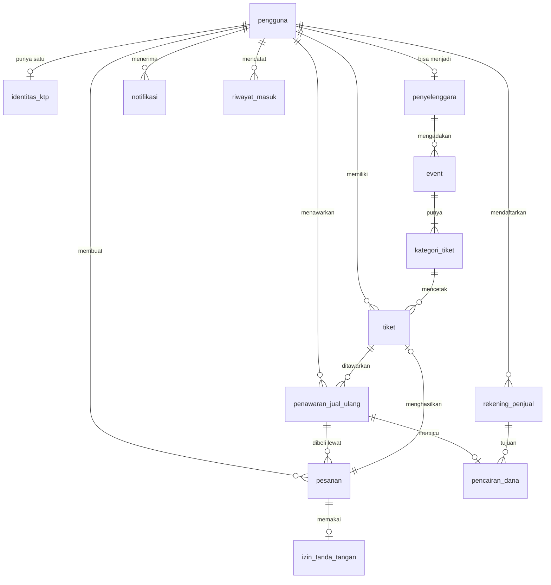

```
STATUS: DRAF — MENUNGGU PERSETUJUAN PEMBIMBING
```

# 04 — Rancangan Database (ERD)

**ERD** adalah singkatan dari *Entity Relationship Diagram*, yaitu gambaran
tabel-tabel database beserta hubungan antar tabelnya.

> ## ⚠ Berkas Ini Belum Final
>
> Pembimbing meminta rancangan database dikonsultasikan lebih dulu sebelum
> dikerjakan. Perkiraan slot konsultasi sekitar **14 Agustus 2026**.
>
> **Berkas ini adalah draf untuk dibawa ke konsultasi**, bukan rancangan yang
> sudah disetujui. Datang dengan draf yang rapi membuat sesi konsultasi jauh
> lebih efektif daripada datang dengan tangan kosong.
>
> **Jangan menulis kode backend maupun spesifikasi API berdasarkan berkas ini
> sebelum statusnya berubah.** Bila tabelnya berubah setelah konsultasi,
> pekerjaan yang terlanjur dibuat akan terbuang.
>
> **Setelah konsultasi:** ubah baris status di paling atas menjadi
> `STATUS: DISETUJUI [tanggal]`, lalu catat perubahan yang diminta pembimbing
> di Bagian 19. Catatan itu berguna saat menulis Bab 4.
>
> **Tambahan 2 September 2026:** rancangan ternyata berkembang di luar berkas
> ini — versi terbaru ada di `design/erd-nft.mwb` (25 Agustus) dan
> `kamus-data-bab4.docx`, dan **berbeda** dari isi berkas ini (skema KYC,
> kolom kata sandi, tabel yang hilang/bertambah). Sebelum keputusan **K10**
> putus (`docs/kerja/keputusan.md`), berkas ini JANGAN dipakai sebagai acuan
> skema; setelah K10 putus, tulis ulang berkas ini mengikuti ERD final.

---

## 1. Ruang Lingkup Database Ini

Database MySQL menyimpan **data operasional di luar blockchain**. Aturan
pembagiannya sudah ditetapkan di
[`03-arsitektur-sistem.md`](03-arsitektur-sistem.md) Bagian 6, dan diulang di
sini sebagai pengingat:

| Tempat | Isinya |
|---|---|
| **Blockchain** | Kepemilikan tiket, kuota, `originalPrice`, jumlah pembelian per dompet, status pemakaian, status penawaran, sidik jari digital KTP |
| **IPFS** | Nama event, tanggal, lokasi, kategori tiket, nomor kursi, gambar |
| **MySQL — berkas ini** | Data akun, **sidik jari digital data KTP beserta *salt***, data rekening penjual, data operasional, dan **salinan** data blockchain untuk mempercepat tampilan |

> **Perubahan 7 Agustus 2026:** rancangan sebelumnya menyimpan **data KTP asli**
> di MySQL. Keputusan itu berubah — **data KTP tidak lagi disimpan dalam bentuk
> terbaca di mana pun**, hanya sidik jari digitalnya. Lihat Bagian 5.

**Aturan yang berlaku untuk seluruh rancangan ini:**

> **Blockchain adalah sumber kebenaran. MySQL hanya salinan untuk mempercepat
> tampilan.**

Setiap kolom di berkas ini yang menyalin data blockchain diberi tanda
**`[salinan]`**. Kolom bertanda itu **tidak boleh dipakai** sebagai dasar
keputusan yang menyangkut kepemilikan, harga, atau kuota — untuk itu wajib
membaca dari blockchain (KNF-03).

---

## 2. Daftar Tabel

Tiga belas tabel.

| No | Tabel | Isinya | Bagian |
|---|---|---|---|
| 1 | `pengguna` | Akun, surel, alamat dompet | 4 |
| 2 | `identitas_ktp` | **Sidik jari digital data KTP** — tidak ada data terbaca | 5 |
| 3 | `penyelenggara` | Data penyelenggara acara | 6 |
| 4 | `event` | Data event | 7 |
| 5 | `kategori_tiket` | Kategori tiket per event beserta harga dan kuota | 8 |
| 6 | `tiket` | Salinan data tiket dari blockchain | 9 |
| 7 | `pesanan` | Riwayat pemesanan dan pembayaran | 10 |
| 8 | `penawaran_jual_ulang` | Penawaran tiket di pasar sekunder | 11 |
| 9 | `rekening_penjual` | **Rekening tujuan pencairan dana penjual** | 12 |
| 10 | `pencairan_dana` | **Penerusan uang hasil penjualan ke penjual** | 13 |
| 11 | `izin_tanda_tangan` | Catatan tanda tangan izin yang sudah diterbitkan | 14 |
| 12 | `notifikasi` | Pemberitahuan kepada pengguna | 15 |
| 13 | `riwayat_masuk` | Catatan aktivitas masuk akun | 16 |

**Empat tabel tidak ada di daftar tabel proposal** — nomor 2, 9, 10, dan 11.
Alasan penambahannya dijelaskan di bagian tabelnya masing-masing.

---

## 3. Diagram Hubungan Antar Tabel



**Cara membaca tanda hubungannya:**

| Tanda | Artinya |
|---|---|
| `\|\|--o\|` | Satu berbanding nol atau satu |
| `\|\|--o{` | Satu berbanding nol atau banyak |
| `\|\|--\|{` | Satu berbanding satu atau banyak |

---

## 4. `pengguna`

Akun pengguna sistem. Satu baris untuk satu orang.

| Kolom | Jenis | Keterangan |
|---|---|---|
| `id` | `BIGINT UNSIGNED` | **Kunci utama**, naik otomatis |
| `surel` | `VARCHAR(255)` | **Unik.** Satu-satunya cara masuk (KF-01) |
| `surel_terverifikasi_pada` | `DATETIME NULL` | Kosong berarti belum diverifikasi (KF-02) |
| `alamat_dompet` | `CHAR(42) NULL` | **Unik.** Alamat *smart account* ERC-4337. Kosong sampai dompet dibuat (KF-03) |
| `peran` | `ENUM('pembeli','penyelenggara','petugas','admin')` | Membedakan hak akses |
| `status` | `ENUM('menunggu_verifikasi','aktif','nonaktif')` | Status akun |
| `dibuat_pada` | `DATETIME` | Waktu pendaftaran |
| `diperbarui_pada` | `DATETIME` | Waktu perubahan terakhir |

**Tidak ada kolom kata sandi.** Pendaftaran dan masuk sepenuhnya lewat
verifikasi surel (KF-01).

**`alamat_dompet` boleh kosong sementara.** Antara akun dibuat dan dompet
selesai dibuat ada jeda (Alur 1 langkah 4 sampai 6). Membuat kolom ini wajib
terisi akan memaksa kedua langkah itu berhasil sekaligus, padahal salah satunya
bisa gagal sendiri.

---

## 5. `identitas_ktp`

**Tabel paling rahasia di seluruh sistem.** Tidak ada di daftar tabel proposal,
karena saat itu ruang lingkup masih menyatakan sistem tidak mencakup
pendaftaran identitas formal. Keputusan itu sudah berubah.

> **Keputusan 7 Agustus 2026: data KTP TIDAK disimpan dalam bentuk terbaca sama
> sekali.** Tidak dienkripsi, melainkan **di-*hash***. Tabel ini karena itu
> **tidak memuat satu pun kolom NIK, nama, atau tanggal lahir yang bisa
> dibaca.**

| Kolom | Jenis | Keterangan |
|---|---|---|
| `id` | `BIGINT UNSIGNED` | **Kunci utama** |
| `pengguna_id` | `BIGINT UNSIGNED` | **Unik.** Merujuk `pengguna.id`. Satu pengguna hanya boleh punya satu identitas |
| `nik_indeks` | `CHAR(66)` | **Unik.** Hasil `keccak256(NIK + pepper sistem)`. **Kunci unik inilah yang menegakkan KF-11**, dan nilai inilah yang dicocokkan petugas di lokasi acara |
| `salt` | `VARBINARY(32)` | ***Salt* acak khusus pengguna ini** (KNF-25) |
| `hash_identitas` | `CHAR(66)` | Hasil `keccak256(NIK + nama lengkap + tanggal lahir + salt)`. Nilai inilah yang dicatat di blockchain **[salinan]** |
| `status` | `ENUM('menunggu_pencatatan','terdaftar')` | Berubah jadi `terdaftar` setelah hash tercatat di blockchain (Alur 1 langkah 15) |
| `dicatat_pada` | `DATETIME NULL` | Waktu hash tercatat di blockchain |
| `dibuat_pada` | `DATETIME` | Waktu pendaftaran |

### 5.1 Kenapa ada DUA hash, bukan satu

Keduanya punya tugas berbeda dan tidak bisa saling menggantikan.

| | `nik_indeks` | `hash_identitas` |
|---|---|---|
| Rumusnya | `keccak256(NIK + pepper sistem)` | `keccak256(NIK + nama + tanggal lahir + salt)` |
| Sifatnya | **Tetap** — NIK sama selalu menghasilkan nilai sama | **Berbeda tiap pengguna** — karena *salt*-nya berbeda |
| Disimpan di | MySQL saja | **Blockchain**, salinannya di MySQL |
| Tugasnya | Menegakkan KF-11 dan mencocokkan identitas di lokasi acara | Mengikat satu identitas utuh pada satu dompet secara permanen |
| Butuh berapa masukan untuk dicocokkan | Cukup NIK | NIK, nama lengkap, dan tanggal lahir |

**Kenapa `nik_indeks` harus tetap:** kunci unik hanya bisa bekerja kalau NIK
yang sama selalu menghasilkan nilai yang sama. *Salt* per pengguna membuat itu
mustahil — dua orang dengan NIK sama akan menghasilkan dua nilai berbeda dan
lolos pemeriksaan.

**Kenapa `hash_identitas` tetap memakai *salt* per pengguna:** nilai inilah yang
tercatat **permanen dan terbuka untuk umum** di blockchain. Di sana perlindungan
terhadap penebakan menyeluruh mutlak diperlukan, dan tidak boleh bergantung pada
satu rahasia bersama.

### 5.2 Soal *pepper* — kenapa boleh di sini padahal ditolak untuk on-chain

***Pepper*** adalah rahasia sistem yang **sama untuk semua pengguna**, disimpan
**di luar database** — misalnya di pengaturan lingkungan server. Fungsinya
membuat `nik_indeks` tidak bisa ditebak lewat percobaan menyeluruh: NIK punya
struktur yang bisa ditebak, sehingga tanpa *pepper*, siapa pun yang memegang
salinan database bisa menghitung hash semua kemungkinan NIK dan mencocokkannya.

**Ini terlihat bertentangan** dengan
[`09-keterbatasan-sistem.md`](09-keterbatasan-sistem.md) Bagian 2 yang menolak
rahasia bersama. Perbedaannya terletak pada **tempat penyimpanannya**:

| | *Pepper* untuk `nik_indeks` (MySQL) | Rahasia bersama untuk hash on-chain (ditolak) |
|---|---|---|
| Data yang dilindungi tersimpan di | MySQL — **tertutup** | Blockchain — **terbuka untuk umum** |
| Penyerang perlu apa untuk mulai menebak | Salinan database **dan** *pepper* | Cukup *pepper* — datanya sudah terbuka |
| Bila rahasianya bocor | Data **bisa dihitung ulang** dengan *pepper* baru | **Tidak bisa diperbaiki** — data on-chain permanen |

Baris terakhir yang menentukan. Kesalahan di MySQL bisa diperbaiki; kesalahan di
blockchain tidak.

### 5.3 Empat hal yang menentukan pada tabel ini

**Tidak ada satu pun data KTP terbaca yang tersimpan.** Kebocoran seluruh isi
tabel ini **tidak membocorkan identitas siapa pun**, selama *pepper* tidak ikut
bocor. Ini perubahan besar dibanding rancangan sebelumnya, dan hampir
menghapuskan keterbatasan nomor 3 di
[`09-keterbatasan-sistem.md`](09-keterbatasan-sistem.md).

**Kunci unik pada `nik_indeks` adalah satu-satunya penegak KF-11.** Pemeriksaan
NIK ganda tetap **tidak bisa dilakukan di dalam smart contract**, karena yang
tercatat di sana adalah `hash_identitas` yang ber-*salt*. Kalau kunci unik ini
dilepas, satu-satunya perlindungan terhadap NIK ganda hilang sepenuhnya.

**`salt` wajib tersimpan sebelum hash dicatat di blockchain.** Kalau hash sudah
tercatat permanen sementara *salt*-nya hilang, **tidak ada cara apa pun
mencocokkan data KTP dengan hash tersebut** — dan hash itu tidak bisa dihapus
dari blockchain. Ini alasan kolom `status` ada: menandai bahwa data sudah
tersimpan tapi hash belum tercatat.

**Kolom `status` memungkinkan pencatatan blockchain diulang** tanpa mengulang
seluruh pendaftaran. Saat mengulang, ***salt* yang sudah tersimpan wajib dipakai
ulang** — jangan dibangkitkan baru, karena hash yang dihasilkan akan berbeda.

### 5.4 Aturan yang mengikat penanganan data KTP

**Data KTP terbaca hanya boleh ada di dalam ingatan server selama pemrosesan
berlangsung, dan tidak boleh disimpan ke mana pun** — tidak ke tabel mana pun,
tidak ke peramban, tidak ke IPFS, tidak ke blockchain, dan **tidak ke catatan
sistem (*log*)** (KNF-24).

Alurnya: data masuk → dihitung `nik_indeks` dan `hash_identitas` → **data
terbaca dibuang** → hanya hasil hash yang disimpan.

**Konsekuensi yang harus disadari:** karena data aslinya tidak pernah disimpan,
**sistem tidak akan pernah bisa menampilkannya kembali** — untuk keperluan apa
pun, termasuk bila pengguna sendiri yang memintanya. Pencocokan identitas hanya
bisa dilakukan dengan cara pengguna menyerahkan kembali data KTP-nya untuk
dibandingkan (Alur 6.2).

---

## 6. `penyelenggara`

| Kolom | Jenis | Keterangan |
|---|---|---|
| `id` | `BIGINT UNSIGNED` | **Kunci utama** |
| `pengguna_id` | `BIGINT UNSIGNED` | **Unik.** Merujuk `pengguna.id` |
| `nama_organisasi` | `VARCHAR(255)` | Nama penyelenggara yang ditampilkan |
| `kontak` | `VARCHAR(255)` | Kontak yang bisa dihubungi |
| `status_verifikasi` | `ENUM('menunggu','terverifikasi','ditolak')` | Tidak sembarang orang boleh membuat event |
| `dibuat_pada` | `DATETIME` | |

**Dipisahkan dari `pengguna` dan bukan sekadar kolom peran** karena
penyelenggara punya data yang tidak dimiliki pembeli biasa, dan punya alur
verifikasinya sendiri.

---

## 7. `event`

| Kolom | Jenis | Keterangan |
|---|---|---|
| `id` | `BIGINT UNSIGNED` | **Kunci utama** |
| `event_id_onchain` | `BIGINT UNSIGNED` | **Unik.** `eventId` di `TicketContract` **[salinan]** |
| `penyelenggara_id` | `BIGINT UNSIGNED` | Merujuk `penyelenggara.id` |
| `nama` | `VARCHAR(255)` | Nama event |
| `kategori_event` | `ENUM(...)` | Enam kategori pada ruang lingkup poin 2 |
| `waktu_pelaksanaan` | `DATETIME` | **[salinan]** |
| `lokasi_venue` | `VARCHAR(255)` | |
| `cid_ipfs` | `VARCHAR(255)` | Alamat keterangan event di IPFS |
| `batas_beli_per_dompet` | `INT UNSIGNED` | **[salinan]** — sumber sahnya di blockchain (KF-19) |
| `status` | `ENUM('draf','dibuka','ditutup','selesai','batal')` | |
| `dibuat_pada` | `DATETIME` | |

**`event_id_onchain` dipisahkan dari `id`** karena keduanya punya peran berbeda:
`id` untuk hubungan antar tabel di MySQL, `event_id_onchain` untuk merujuk ke
blockchain. Menyatukannya membuat urutan penomoran MySQL terikat pada urutan
pembuatan di blockchain — dan keduanya bisa gagal secara terpisah.

---

## 8. `kategori_tiket`

Satu event punya satu atau lebih kategori tiket, masing-masing dengan harga dan
kuota sendiri (KF-16).

| Kolom | Jenis | Keterangan |
|---|---|---|
| `id` | `BIGINT UNSIGNED` | **Kunci utama** |
| `event_id` | `BIGINT UNSIGNED` | Merujuk `event.id` |
| `category_id_onchain` | `BIGINT UNSIGNED` | `categoryId` di `TicketContract` **[salinan]** |
| `nama` | `VARCHAR(100)` | Misalnya VIP, Reguler, Tribun |
| `harga` | `DECIMAL(20,0)` | Menjadi `originalPrice` **[salinan]** |
| `kuota` | `INT UNSIGNED` | **[salinan]** |
| `terjual` | `INT UNSIGNED` | **[salinan]** — untuk tampilan cepat |
| `nomor_kursi_awal` | `VARCHAR(20) NULL` | Bila kategori ini bernomor kursi |

**Kunci unik gabungan:** `(event_id, category_id_onchain)`.

**Kolom `kuota` dan `terjual` bertanda [salinan] dengan sengaja.** Keduanya
boleh dipakai untuk menampilkan sisa kuota di halaman katalog, tapi
**pemeriksaan sebelum pembelian wajib membaca dari blockchain** (KF-27, Alur 2
langkah 9). Kalau keputusan diambil dari salinan, kuota bisa terlampaui saat
salinan tertinggal dari keadaan sebenarnya.

---

## 9. `tiket`

**Seluruh tabel ini adalah salinan.** Sumber kebenarannya `TicketContract`.

| Kolom | Jenis | Keterangan |
|---|---|---|
| `id` | `BIGINT UNSIGNED` | **Kunci utama** |
| `token_id` | `BIGINT UNSIGNED` | **Unik.** `tokenId` NFT **[salinan]** |
| `event_id` | `BIGINT UNSIGNED` | Merujuk `event.id` |
| `kategori_tiket_id` | `BIGINT UNSIGNED` | Merujuk `kategori_tiket.id` |
| `pemilik_pengguna_id` | `BIGINT UNSIGNED` | Merujuk `pengguna.id` **[salinan]** |
| `original_price` | `DECIMAL(20,0)` | **[salinan]** — patokan penguncian harga |
| `sudah_dipakai` | `BOOLEAN` | **[salinan]** |
| `dipakai_pada` | `DATETIME NULL` | Waktu penukaran di lokasi acara |
| `cid_metadata` | `VARCHAR(255)` | Alamat keterangan tiket di IPFS |
| `nomor_kursi` | `VARCHAR(20) NULL` | |
| `dicetak_pada` | `DATETIME` | |
| `disinkronkan_pada` | `DATETIME` | **Kapan salinan ini terakhir disamakan dengan blockchain** |

**Kolom `disinkronkan_pada` ada supaya salinan yang basi bisa dikenali.** Tanpa
kolom itu, tidak ada cara membedakan salinan yang baru saja diperbarui dari
salinan yang tertinggal jauh.

**`pemilik_pengguna_id` bertanda [salinan] dan itu penting.** Setiap keputusan
yang menyangkut kepemilikan — misalnya apakah seseorang berhak menawarkan tiket
— **wajib dibaca dari blockchain** (KF-38, KNF-03). Kolom ini hanya untuk
menampilkan halaman "tiket saya" dengan cepat.

---

## 10. `pesanan`

Riwayat pemesanan dan pembayaran, untuk pembelian awal maupun pembelian tiket
jual ulang.

| Kolom | Jenis | Keterangan |
|---|---|---|
| `id` | `BIGINT UNSIGNED` | **Kunci utama** |
| `kode_pesanan` | `VARCHAR(64)` | **Unik.** Nomor pesanan yang dikirim ke Midtrans |
| `pengguna_id` | `BIGINT UNSIGNED` | Pembeli |
| `jenis` | `ENUM('primer','sekunder')` | Pembelian awal atau pembelian tiket jual ulang |
| `kategori_tiket_id` | `BIGINT UNSIGNED NULL` | Diisi bila `jenis` = `primer` |
| `penawaran_id` | `BIGINT UNSIGNED NULL` | Diisi bila `jenis` = `sekunder` |
| `tiket_id` | `BIGINT UNSIGNED NULL` | Diisi setelah tiket tercetak atau berpindah |
| `jumlah_bayar` | `DECIMAL(20,0)` | |
| `status` | `ENUM('menunggu_bayar','lunas','gagal','kedaluwarsa','tiket_terbit','dibatalkan')` | |
| `midtrans_transaction_id` | `VARCHAR(128) NULL` | Dari Midtrans |
| `dibayar_pada` | `DATETIME NULL` | Waktu Midtrans menyatakan lunas |
| `tiket_terbit_pada` | `DATETIME NULL` | Waktu tiket tercetak atau berpindah |
| `dibuat_pada` | `DATETIME` | |

### 10.1 Kenapa `status` punya nilai `lunas` DAN `tiket_terbit`

**Ini bukan pengulangan.** Jeda antara keduanya adalah keadaan paling berbahaya
di seluruh sistem: **pengguna sudah membayar tapi belum punya tiket** (Alur 2
Bagian 4.3).

Memisahkan kedua status membuat keadaan itu bisa dikenali dan diperbaiki.
Pesanan dengan status `lunas` yang belum menjadi `tiket_terbit` adalah daftar
pekerjaan yang harus diulang — tanpa meminta pengguna membayar lagi (KNF-20).

Kalau keduanya digabung menjadi satu status, keadaan itu **tidak bisa dibedakan
dari pesanan yang sudah selesai**, dan pengguna akan kehilangan uang tanpa ada
yang mengetahui.

### 10.2 Kenapa `kode_pesanan` harus unik

Kunci unik ini adalah **penegak pencegahan tiket ganda** (KNF-21, Alur 2 langkah
15). Layanan pembayaran pada umumnya mengirim ulang pemberitahuan bila balasan
pertama tidak diterima dengan baik. Pemeriksaan berdasarkan `kode_pesanan` dan
`status` yang sudah `tiket_terbit` mencegah pemberitahuan kedua memicu
pencetakan kedua.

---

## 11. `penawaran_jual_ulang`

| Kolom | Jenis | Keterangan |
|---|---|---|
| `id` | `BIGINT UNSIGNED` | **Kunci utama** |
| `tiket_id` | `BIGINT UNSIGNED` | Merujuk `tiket.id` |
| `penjual_pengguna_id` | `BIGINT UNSIGNED` | Merujuk `pengguna.id` **[salinan]** |
| `harga` | `DECIMAL(20,0)` | **Selalu sama dengan `tiket.original_price`** **[salinan]** |
| `status` | `ENUM('aktif','terkunci','terjual','dibatalkan','kedaluwarsa')` | |
| `dikunci_untuk_pengguna_id` | `BIGINT UNSIGNED NULL` | **Pembeli yang sedang dalam proses pembayaran** |
| `dikunci_sampai` | `DATETIME NULL` | **Batas waktu kunci.** Lewat batas ini, penawaran kembali terbuka |
| `pembeli_pengguna_id` | `BIGINT UNSIGNED NULL` | Diisi setelah terjual |
| `dibuat_pada` | `DATETIME` | |
| `selesai_pada` | `DATETIME NULL` | |

**Kolom `harga` tidak pernah diisi dari masukan penjual.** Nilainya disalin dari
`originalPrice` yang dibaca dari blockchain (KF-40). Kolom ini ada sebagai
catatan penawaran, bukan sebagai tempat penjual menentukan harga.

### 11.1 Penguncian penawaran — pencegahan perebutan pembeli

> **Keputusan 7 Agustus 2026:** perebutan dua pembeli atas satu tiket
> **dicegah**, bukan diperbaiki setelah terjadi.

Ketiga kolom `status`, `dikunci_untuk_pengguna_id`, dan `dikunci_sampai` bekerja
bersama:

```
Pembeli A menekan bayar
  → status jadi 'terkunci'
  → dikunci_untuk_pengguna_id = A
  → dikunci_sampai = sekarang + batas waktu

Pembeli B menekan bayar
  → ditolak, karena status bukan 'aktif'
  → B belum mengeluarkan uang sama sekali

A membayar berhasil       → status 'terjual'
A gagal atau lewat batas  → status kembali 'aktif', kedua kolom kunci dikosongkan
```

**Kenapa dicegah dan bukan dikembalikan uangnya:** kalau kedua pembeli
dibiarkan membayar, salah satunya pasti harus dikembalikan uangnya. Itu menuntut
tabel pengembalian dana dan alur pengembalian lewat Midtrans — **yang tidak bisa
diuji sungguhan di lingkungan sandbox**. Mencegahnya di depan menghapus seluruh
kebutuhan itu.

**Yang wajib diperhatikan saat menulis kode:** perubahan status menjadi
`terkunci` harus dilakukan **dalam satu transaksi database yang mengunci baris
tersebut**. Kalau hanya memeriksa status lalu mengubahnya sebagai dua langkah
terpisah, dua permintaan yang datang bersamaan bisa sama-sama lolos pemeriksaan
sebelum salah satunya sempat mengubah status — dan perebutan yang ingin dicegah
justru terjadi di sini.

**Kunci kedaluwarsa harus dibersihkan.** Penawaran yang `dikunci_sampai`-nya
sudah lewat wajib kembali menjadi `aktif`, entah lewat tugas berkala atau lewat
pemeriksaan saat penawaran diakses. Tanpa itu, pembayaran yang ditinggalkan
pembeli akan mengunci tiket selamanya.

**Hanya boleh ada satu penawaran aktif atau terkunci per tiket.** Ini perlu
ditegakkan, entah lewat kunci unik sebagian atau lewat pemeriksaan di server.
**Cara terbaiknya perlu dibahas saat konsultasi** — MySQL tidak mendukung kunci
unik bersyarat secara langsung.

---

## 12. `rekening_penjual`

**Tabel ini tidak ada di daftar tabel proposal**, karena penerusan uang ke
penjual belum dirancang saat itu.

> **Keputusan 7 Agustus 2026:** uang hasil penjualan kembali diteruskan ke
> **rekening bank penjual lewat Midtrans**, bukan lewat blockchain.

| Kolom | Jenis | Keterangan |
|---|---|---|
| `id` | `BIGINT UNSIGNED` | **Kunci utama** |
| `pengguna_id` | `BIGINT UNSIGNED` | Merujuk `pengguna.id` |
| `nama_bank` | `VARCHAR(100)` | Bank tujuan |
| `nomor_rekening` | `VARCHAR(64)` | Nomor rekening tujuan |
| `nama_pemilik_rekening` | `VARCHAR(255)` | Nama sesuai buku rekening |
| `status_verifikasi` | `ENUM('menunggu','terverifikasi','ditolak')` | |
| `utama` | `BOOLEAN` | Penanda rekening yang dipakai secara bawaan |
| `dibuat_pada` | `DATETIME` | |

**Kenapa rekening didaftarkan terpisah dan tidak diambil dari data KTP:** data
KTP sudah tidak tersimpan dalam bentuk terbaca (Bagian 5), jadi nama pemilik
rekening tidak bisa diambil dari sana. Selain itu nama di rekening tidak selalu
sama persis dengan nama di KTP.

**Perlu diputuskan saat konsultasi:** apakah nama pemilik rekening perlu
dicocokkan dengan identitas terdaftar. Pencocokan itu **tidak bisa dilakukan
otomatis** karena data KTP terbaca tidak tersimpan — hanya bisa lewat penelaahan
manual atau lewat pengguna memasukkan ulang nama KTP-nya untuk dibandingkan
dengan hash.

---

## 13. `pencairan_dana`

Mencatat penerusan uang hasil penjualan kembali dari sistem ke penjual.

| Kolom | Jenis | Keterangan |
|---|---|---|
| `id` | `BIGINT UNSIGNED` | **Kunci utama** |
| `penawaran_id` | `BIGINT UNSIGNED` | **Unik.** Merujuk `penawaran_jual_ulang.id` |
| `penjual_pengguna_id` | `BIGINT UNSIGNED` | Merujuk `pengguna.id` |
| `rekening_id` | `BIGINT UNSIGNED` | Merujuk `rekening_penjual.id` |
| `jumlah` | `DECIMAL(20,0)` | Sama dengan harga penawaran, dikurangi potongan bila ada |
| `status` | `ENUM('menunggu','diproses','berhasil','gagal')` | |
| `midtrans_payout_id` | `VARCHAR(128) NULL` | Nomor rujukan dari Midtrans |
| `diproses_pada` | `DATETIME NULL` | |
| `selesai_pada` | `DATETIME NULL` | |
| `keterangan_gagal` | `VARCHAR(255) NULL` | Alasan bila gagal |

### 13.1 Kenapa `penawaran_id` harus unik

Kunci unik ini adalah **penegak pencegahan pencairan ganda**. Tanpa itu, satu
penjualan bisa memicu dua kali pencairan bila proses pemicunya terulang — dan
berbeda dari tiket yang bisa dibakar, **uang yang sudah dicairkan tidak bisa
ditarik kembali.**

Ini pola yang sama dengan `kode_pesanan` di tabel `pesanan` (Bagian 10.2), dan
alasannya sama: setiap langkah yang tidak bisa dibatalkan wajib punya penjaga
agar tidak terjadi dua kali.

### 13.2 Urutan yang wajib dipatuhi

**Pencairan dana hanya boleh dimulai setelah kepemilikan tiket benar-benar
berpindah di blockchain**, bukan setelah pembayaran pembeli lunas.

| Urutan | Akibatnya |
|---|---|
| Bayar lunas → **cairkan** → pindahkan tiket | **Berbahaya.** Bila perpindahan gagal, uang sudah terlanjur keluar sementara tiket masih milik penjual |
| Bayar lunas → pindahkan tiket → **cairkan** | **Benar.** Uang baru keluar setelah pembeli benar-benar menerima tiketnya |

### 13.3 Yang tidak bisa diuji

Pencairan dana **tidak bisa diuji sungguhan** di Midtrans sandbox. Statusnya
`[BUTUH DATA UJI]` untuk bagian yang menyangkut keberhasilan pencairan
sesungguhnya. Dicatat di
[`09-keterbatasan-sistem.md`](09-keterbatasan-sistem.md) Bagian 9.

---

## 14. `izin_tanda_tangan`

**Tabel ini tidak ada di daftar tabel proposal**, dan tanpa tabel ini
perlindungan terhadap pemakaian ulang tanda tangan tidak bisa dikelola dari sisi
server.

| Kolom | Jenis | Keterangan |
|---|---|---|
| `id` | `BIGINT UNSIGNED` | **Kunci utama** |
| `nonce` | `VARCHAR(66)` | **Unik.** Nomor urut sekali pakai |
| `jenis` | `ENUM('daftar_identitas','cetak_tiket','tandai_terpakai','tawarkan','batal_tawaran','jual')` | Jenis izin yang diterbitkan |
| `pesanan_id` | `BIGINT UNSIGNED NULL` | Merujuk `pesanan.id` bila izin ini terkait pembelian |
| `deadline` | `DATETIME` | Batas waktu berlaku |
| `status` | `ENUM('diterbitkan','terpakai','kedaluwarsa')` | |
| `diterbitkan_pada` | `DATETIME` | |
| `terpakai_pada` | `DATETIME NULL` | |

**Kenapa perlu dicatat di server padahal smart contract juga mencatatnya:**
kontrak hanya tahu sebuah `nonce` sudah terpakai atau belum. Server perlu tahu
lebih banyak — untuk apa izin itu diterbitkan, terkait pesanan mana, dan apakah
perlu diterbitkan ulang bila transaksinya gagal. Tanpa catatan ini, pengulangan
transaksi yang gagal (KNF-20) tidak punya dasar.

---

## 15. `notifikasi`

| Kolom | Jenis | Keterangan |
|---|---|---|
| `id` | `BIGINT UNSIGNED` | **Kunci utama** |
| `pengguna_id` | `BIGINT UNSIGNED` | Penerima |
| `jenis` | `ENUM('pembayaran','tiket_terbit','tiket_terjual','umum')` | KF-52 sampai KF-54 |
| `judul` | `VARCHAR(255)` | |
| `isi` | `TEXT` | |
| `tautan` | `VARCHAR(255) NULL` | Halaman tujuan bila diklik |
| `sudah_dibaca` | `BOOLEAN` | |
| `dibuat_pada` | `DATETIME` | |

---

## 16. `riwayat_masuk`

| Kolom | Jenis | Keterangan |
|---|---|---|
| `id` | `BIGINT UNSIGNED` | **Kunci utama** |
| `pengguna_id` | `BIGINT UNSIGNED NULL` | Kosong bila surelnya tidak dikenali |
| `surel_dicoba` | `VARCHAR(255)` | Surel yang dipakai mencoba masuk |
| `alamat_ip` | `VARBINARY(16)` | Mendukung IPv4 dan IPv6 |
| `keterangan_peramban` | `VARCHAR(255)` | |
| `hasil` | `ENUM('berhasil','gagal')` | |
| `waktu` | `DATETIME` | |

**Kolom `pengguna_id` boleh kosong dengan sengaja.** Percobaan masuk dengan
surel yang tidak terdaftar tetap perlu dicatat, karena justru pola percobaan
semacam itu yang menunjukkan adanya upaya penyusupan.

---

## 17. Tabel dan Kolom yang DIHAPUS dari Proposal

Ruang lingkup proposal poin 10 mendaftar beberapa tabel yang **sudah tidak
relevan** setelah *commit-reveal* dan *flash sale* dihapus.

| Yang dihapus | Alasan |
|---|---|
| Tabel `flash_sale` | *Flash sale* bukan lagi bagian sistem — alur utama tinggal tiga |
| Tabel fase *flash sale* | Ikut terhapus bersama *flash sale* |
| Kolom `commitHash` | Bagian dari skema *commit-reveal* yang sudah dihapus |
| Tabel atau kolom pengingat *flash sale* | Ikut terhapus bersama *flash sale* |

Alasan lengkap penghapusannya ada di
[`03-arsitektur-sistem.md`](03-arsitektur-sistem.md) Bagian 4.3.

---

## 18. Daftar Pertanyaan untuk Konsultasi

Disusun agar sesi konsultasi bisa langsung membahas hal yang belum diputuskan.

### 18.1 Sudah diputuskan 7 Agustus 2026

Tiga pertanyaan terbesar sudah dijawab dan **sudah diterapkan** ke rancangan ini.
Didaftar di sini agar keputusannya bisa disampaikan saat konsultasi.

| Pertanyaan | Keputusan | Diterapkan di |
|---|---|---|
| Bagaimana uang hasil penjualan kembali sampai ke penjual? | **Diteruskan ke rekening bank penjual lewat Midtrans**, setelah kepemilikan tiket berpindah | Bagian 12 dan 13 |
| Bagaimana menangani dua pembeli yang mengejar satu tiket? | **Dicegah, bukan dikembalikan uangnya** — penawaran dikunci begitu satu pembeli mulai membayar | Bagian 11.1 |
| Perlukah data KTP dienkripsi di database? | **Tidak dienkripsi, melainkan di-*hash*** — tidak ada data KTP terbaca di mana pun | Bagian 5 |

### 18.2 Masih perlu dibahas

| No | Pertanyaan | Kenapa perlu diputuskan |
|---|---|---|
| 1 | Cara terbaik menegakkan **satu penawaran aktif atau terkunci per tiket** di MySQL | MySQL tidak mendukung kunci unik bersyarat secara langsung (Bagian 11) |
| 2 | **Berapa lama batas waktu penguncian penawaran** sebelum dilepas kembali? | Terlalu pendek merugikan pembeli yang sedang membayar; terlalu panjang menahan tiket tanpa perlu (Bagian 11.1) |
| 3 | Perlukah **nama pemilik rekening dicocokkan** dengan identitas terdaftar? | Tidak bisa dilakukan otomatis karena data KTP terbaca tidak tersimpan (Bagian 12) |
| 4 | Adakah **potongan biaya** pada pencairan dana ke penjual? | Menentukan cara menghitung kolom `jumlah` di tabel `pencairan_dana` (Bagian 13) |
| 5 | Perlukah tabel untuk **petugas lokasi acara** dan penugasannya per event? | Saat ini petugas hanya berupa nilai peran di tabel `pengguna` |
| 6 | Berapa lama sidik jari digital identitas disimpan setelah event selesai? | Menyimpan selamanya menambah risiko tanpa manfaat — meskipun risikonya sudah jauh berkurang setelah data terbaca dihapus |
| 7 | Apakah pemisahan `id` dan `*_onchain` di tabel `event` dan `kategori_tiket` sudah tepat? | Menentukan cara menangani kegagalan pencatatan blockchain (Bagian 7) |
| 8 | **Di mana *pepper* disimpan** dan bagaimana cara menggantinya bila bocor? | *Pepper* tidak boleh berada di dalam database yang dilindunginya (Bagian 5.2) |

---

## 19. Catatan Hasil Konsultasi

> **Bagian ini diisi setelah konsultasi dengan pembimbing.**
>
> Catat: perubahan yang diminta, alasan yang disampaikan, dan bagian mana yang
> disetujui apa adanya. Catatan ini menjadi bahan langsung saat menulis Bab 4,
> karena menunjukkan bahwa rancangan melewati proses penelaahan — bukan disusun
> sendiri tanpa masukan.

| Tanggal | Yang diminta berubah | Alasan | Status |
|---|---|---|---|
| — | *(belum ada konsultasi)* | — | — |
