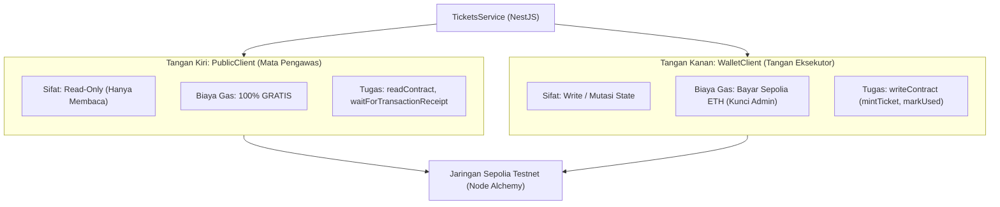
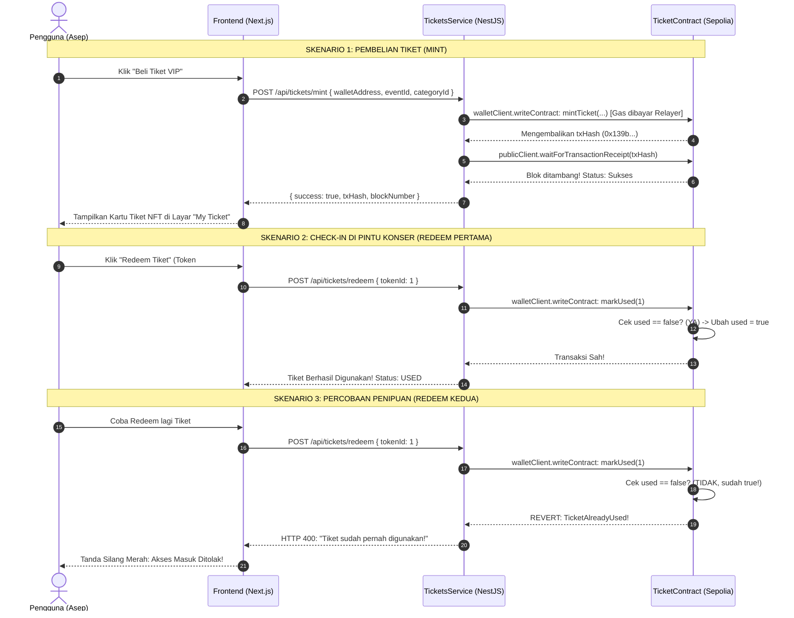

# Penjelasan 10: Panduan Lengkap & Mudah Memahami TicketsService (Jembatan Backend NestJS ke Blockchain Sepolia)

Dokumen ini menjelaskan secara menyeluruh cara kerja file `backend/src/tickets/tickets.service.ts` menggunakan bahasa yang sederhana, analogi kehidupan sehari-hari, diagram alur visual, serta **tabel pemetaan parameter lengkap beserta file asal dan nomor baris kodenya**.

Dokumen ini ditujukan sebagai pegangan belajar mandiri dan bahan argumentasi Tugas Akhir (TA).

---

## 1. Masalah Besar Web3 & Solusi "Relayer"

### Masalah Pengguna Awam di Dunia Blockchain
Bayangkan ada penonton konser bernama **Asep**:
1. Asep hanya ingin membeli tiket konser musik kampusnya dengan mudah.
2. Asep mendaftar hanya menggunakan **Email** dan **Sidik Jari (Passkey)**.
3. Asep **sama sekali tidak punya koin cryptocurrency (ETH)**, tidak punya dompet MetaMask, dan tidak paham apa itu gas fee.
4. Jika Asep disuruh membuka aplikasi kripto, membeli saldo ETH di bursa (*exchange*), lalu mentransfernya ke Sepolia hanya untuk membayar biaya transaksi (*gas fee*), Asep pasti akan langsung membatalkan niatnya.

### Solusi: `TicketsService` Sebagai Petugas Loket Resmi (Relayer)
Di sinilah peran penting file `tickets.service.ts`:

```
+---------------------------------------------------------------------------------+
|                                 ANALOGI LOKET KONSER                            |
|                                                                                 |
|   [ Asep (Penonton Awam) ]                                                      |
|         │                                                                       |
|         │ "Mbak, saya mau beli tiket VIP atas nama dompet saya (0x811a...)"    |
|         ▼                                                                       |
|   [ TicketsService (Petugas Loket Resmi) ]                                      |
|         │                                                                       |
|         │ Petugas mengambil "Kartu Bensin Panitia" (ADMIN_PRIVATE_KEY)          |
|         │ Petugas mendatangi mesin cetak tiket blockchain                       |
|         ▼                                                                       |
|   [ Smart Contract di Sepolia (Mesin Cetak Tiket NFT) ]                         |
|         │                                                                       |
|         │ 1. Mesin memotong biaya cetak (Gas Fee) dari Kartu Panitia           |
|         │ 2. Mesin mencetak Tiket NFT #1 dengan pemilik: Dompet Asep!           |
|         ▼                                                                       |
|   [ Hasil Akhir ]                                                               |
|   Tiket resmi tersimpan di dompet Asep, tanpa Asep keluar koin kripto 1 rupiah pun! |
+---------------------------------------------------------------------------------+
```

Konsep ini dalam dunia blockchain disebut **Gasless Onboarding / Relayer Architecture**. Server backend bertindak sebagai pihak yang menanggung biaya bensin (*gas sponsor*), sehingga pengalaman pengguna terasa semudah menggunakan aplikasi web biasa (Web2) namun memiliki keamanan sekuat blockchain (Web3).

---

## 2. Anatomi "Dua Tangan" Viem di dalam Service

Di dalam `TicketsService`, kita menggunakan library resmi Ethereum bernama **Viem**. 
Agar backend bisa berkomunikasi dengan blockchain Sepolia, backend dilengkapi dengan **"Dua Tangan"**:



| Komponen | Nama di Kode | Tugas Utama | Butuh Saldo ETH? |
| :--- | :--- | :--- | :--- |
| **Mata Pengawas** | `publicClient` | Membaca data smart contract dan menunggu blok ditambang | **TIDAK (Gratis)** |
| **Tangan Eksekutor** | `walletClient` | Menandatangani dan mengirim transaksi perubahan data | **YA (Pakai ETH Admin)** |
| **Identitas Penandatangan** | `account` | Dihasilkan dari `ADMIN_PRIVATE_KEY` di file `.env` | - |

---

## 3. Tabel Pemetaan Parameter & Referensi Antar-File

Setiap parameter yang diproses di `tickets.service.ts` saling terhubung erat dengan file DTO, file konfigurasi `.env`, file ABI, dan file smart contract Solidity.

### Tabel Pemetaan Komprehensif

| Fungsi di Service | Parameter Input | Tipe Data TypeScript | File Asal Definisi | File & Baris Smart Contract (`TicketContract.sol`) | Definisi di ABI (`ticket-abi.ts`) |
| :--- | :--- | :--- | :--- | :--- | :--- |
| **`constructor`** | `configService` | `ConfigService` | Injeksi bawaan NestJS (`@nestjs/config`) | - | - |
| | `SEPOLIA_RPC_URL` | `string` | [`backend/.env`](file:///d:/STEVE/Project%20NFT%20Marketplace/backend/.env) (Baris 2) | Node RPC Alchemy Sepolia | - |
| | `ADMIN_PRIVATE_KEY` | `` `0x${string}` `` | [`backend/.env`](file:///d:/STEVE/Project%20NFT%20Marketplace/backend/.env) (Baris 3) | Akun pemotong gas deployer/relayer | - |
| | `TICKET_CONTRACT_ADDRESS` | `` `0x${string}` `` | [`backend/.env`](file:///d:/STEVE/Project%20NFT%20Marketplace/backend/.env) (Baris 1) | Alamat kontrak Sepolia: `0x4A6e...F9b3` | - |
| **`mintTicket`** | `dto.walletAddress` | `string` (`address`) | [`mint-ticket.dto.ts`](file:///d:/STEVE/Project%20NFT%20Marketplace/backend/src/tickets/dto/mint-ticket.dto.ts) (Baris 4–6) | Parameter `address to` pada Baris 163 | Baris 9: `{ name: 'to', type: 'address' }` |
| | `dto.eventId` | `number` -> `bigint` | [`mint-ticket.dto.ts`](file:///d:/STEVE/Project%20NFT%20Marketplace/backend/src/tickets/dto/mint-ticket.dto.ts) (Baris 8–10) | Parameter `uint256 eventId` pada Baris 163 | Baris 10: `{ name: 'eventId', type: 'uint256' }` |
| | `dto.categoryId` | `number` -> `bigint` | [`mint-ticket.dto.ts`](file:///d:/STEVE/Project%20NFT%20Marketplace/backend/src/tickets/dto/mint-ticket.dto.ts) (Baris 12–14) | Parameter `uint256 categoryId` pada Baris 163 | Baris 11: `{ name: 'categoryId', type: 'uint256' }` |
| **`redeemTicket`**| `tokenId` | `number` -> `bigint` | [`redeem-ticket.dto.ts`](file:///d:/STEVE/Project%20NFT%20Marketplace/backend/src/tickets/dto/redeem-ticket.dto.ts) (Baris 4–6) | Parameter `uint256 tokenId` pada Baris 211 | Baris 19: `{ name: 'tokenId', type: 'uint256' }` |
| **`getTicket`** | `tokenId` | `number` -> `bigint` | URL Param (`GET /api/tickets/:tokenId`) | Parameter `uint256 tokenId` pada Baris 230 & Standar ERC-721 | Baris 26 (`getTicket`) & Baris 43 (`ownerOf`) |

---

## 4. Bedah Baris demi Baris Kode `tickets.service.ts`

Berikut adalah bedah tuntas setiap blok kode di [`backend/src/tickets/tickets.service.ts`](file:///d:/STEVE/Project%20NFT%20Marketplace/backend/src/tickets/tickets.service.ts).

```
File Asli: backend/src/tickets/tickets.service.ts (Total 156 Baris)
```

---

### Bagian A: Inisialisasi & Constructor (Baris 1–47)

```typescript
// [backend/src/tickets/tickets.service.ts: Baris 1-11]
import {
  Injectable,
  BadRequestException,
  InternalServerErrorException,
} from '@nestjs/common';
import { ConfigService } from '@nestjs/config';
import { createPublicClient, createWalletClient, http } from 'viem';
import { privateKeyToAccount } from 'viem/accounts';
import { TICKET_CONTRACT_ABI } from './ticket-abi';
import { sepolia } from 'viem/chains';
import { MintTicketDto } from './dto/mint-ticket.dto';

@Injectable()
export class TicketsService {
  private publicClient;
  private walletClient;
  private account;
  private contractAddress: `0x${string}`;

  // [backend/src/tickets/tickets.service.ts: Baris 20-47]
  constructor(private configService: ConfigService) {
    // 1. Mengambil konfigurasi dari file backend/.env
    const RPC_URL = this.configService.get<string>('SEPOLIA_RPC_URL')!;
    const privateKey = this.configService.get<string>(
      'ADMIN_PRIVATE_KEY',
    ) as `0x${string}`;
    this.contractAddress = this.configService.get<string>(
      'TICKET_CONTRACT_ADDRESS',
    ) as `0x${string}`;

    // 2. Mengubah private key heksadesimal menjadi identitas akun kriptografi di memori server
    this.account = privateKeyToAccount(privateKey);

    // 3. Menyiapkan PublicClient (Mata Pengawas - Read Only)
    this.publicClient = createPublicClient({
      chain: sepolia,
      transport: http(RPC_URL),
    });

    // 4. Menyiapkan WalletClient (Tangan Eksekutor - Transactor)
    this.walletClient = createWalletClient({
      account: this.account,
      chain: sepolia,
      transport: http(RPC_URL),
    });
  }
```

#### Penjelasan Logika & Asal Parameter:
1. **`ConfigService`**: Modul dependency injection bawaan NestJS.
2. **`RPC_URL` (Baris 22)**: Mengambil nilai variabel `SEPOLIA_RPC_URL` dari file [`backend/.env`](file:///d:/STEVE/Project%20NFT%20Marketplace/backend/.env) (koneksi ke Alchemy Sepolia).
3. **`privateKey` (Baris 23–25)**: Mengambil `ADMIN_PRIVATE_KEY` dari file `.env`. Private key ini adalah milik admin relayer yang memiliki saldo Sepolia ETH untuk membayar gas.
4. **`this.contractAddress` (Baris 26–28)**: Alamat kontrak `TicketContract` yang telah berhasil dideploy di Sepolia (`0x4A6e85fACA6df9eb2dB5BA832B4B48790D60F9b3`).
5. **`privateKeyToAccount(privateKey)` (Baris 31)**: Diimpor dari `viem/accounts`. Fungsi ini secara matematis menurunkan *Public Key* dan *Address* dari private key, serta menyediakan metode *signing* transaksi di memori server tanpa perlu software pihak ketiga seperti MetaMask.

---

### Bagian B: Fungsi `mintTicket()` (Baris 49–89)

Fungsi ini dieksekusi saat pengguna menekan tombol **"Beli Tiket"** di web.

```typescript
// [backend/src/tickets/tickets.service.ts: Baris 49-89]
  async mintTicket(dto: MintTicketDto) {
    try {
      console.log(' [TicketsService] Minting tiket untuk ' + dto.walletAddress);

      // 1. Eksekusi transaksi on-chain ke smart contract
      const hash = await this.walletClient.writeContract({
        address: this.contractAddress,
        abi: TICKET_CONTRACT_ABI,
        functionName: 'mintTicket',
        // Nilai dikonversi menjadi BigInt karena di Solidity bertipe uint256
        args: [
          dto.walletAddress as `0x${string}`,
          BigInt(dto.eventId),
          BigInt(dto.categoryId),
        ],
      });

      console.log(
        `Transaksi dikirim ke Sepolia dengan txHash: ${hash}. Menunggu konfirmasi blok ...`,
      );

      // 2. Menunggu sampai transaksi resmi ditambang ke dalam blok oleh validator Sepolia
      const receipt = await this.publicClient.waitForTransactionReceipt({
        hash: hash,
      });

      // 3. Mengembalikan respon sukses ke controller
      return {
        success: true,
        message: 'Tiket berhasil dicetak pada jaringan Sepolia Testnet',
        txHash: hash,
        blockNumber: Number(receipt.blockNumber),
      };
    } catch (error: any) {
      console.error('Error minting ticket:', error);
      // NestJS Exception Filter: melempar pesan error HTTP 400 ke frontend
      throw new BadRequestException(
        error?.shortMessage ||
          error?.message ||
          'Gagal mencetak tiket on-chain',
      );
    }
  }
```

#### Penjelasan Rinci Parameter & Alur:
1. **Parameter `dto: MintTicketDto` (Baris 49)**:
   * Didefinisikan di [`backend/src/tickets/dto/mint-ticket.dto.ts`](file:///d:/STEVE/Project%20NFT%20Marketplace/backend/src/tickets/dto/mint-ticket.dto.ts) Baris 3–15.
   * `dto.walletAddress` (Baris 60): Alamat Smart Account milik pembeli tiket (misal `0x811a...`).
   * `dto.eventId` (Baris 61): ID event (misal `1`).
   * `dto.categoryId` (Baris 62): ID kategori tiket (misal `1` untuk VIP).
2. **Koneksi ke Smart Contract:**
   * Memanggil fungsi Solidity:
     ```solidity
     // [contracts/src/TicketContract.sol: Baris 163]
     function mintTicket(address to, uint256 eventId, uint256 categoryId) external returns (uint256)
     ```
   * Sesuai dengan spesifikasi ABI di [`backend/src/tickets/ticket-abi.ts`](file:///d:/STEVE/Project%20NFT%20Marketplace/backend/src/tickets/ticket-abi.ts) Baris 2–15.
3. **Mengapa Harus Membungkus dengan `BigInt()`?**
   * Di JavaScript standar, tipe data `Number` hanya aman menampung angka integer hingga $2^{53} - 1$ (sekitar 9 kuadriliun).
   * Sedangkan di Solidity, tipe data `uint256` dapat menampung angka hingga 78 digit ($2^{256} - 1$).
   * Agar tidak terjadi kesalahan konversi bit (*overflow*), Viem mewajibkan angka dibungkus dengan **`BigInt(...)`**.
4. **Beda `hash` vs `receipt`:**
   * **`hash` (Baris 54)**: Nomor ID transaksi (seperti nomor resi kurir pengiriman). Nilai ini langsung keluar begitu transaksi diserahkan ke jaringan.
   * **`receipt` (Baris 71–73)**: Tanda terima resmi bahwa transaksi **sudah valid dan sudah ditambang ke dalam sebuah blok permanen** oleh validator blockchain.
5. **Penanganan Error Bersih (`error?.shortMessage`) (Baris 84)**:
   * Jika transaksi ditolak on-chain (misal: kuota habis `QuotaExceeded()`), node Ethereum akan mengembalikan teks error teknis yang sangat panjang.
   * Viem menyediakan properti **`error.shortMessage`** yang memangkas data mentah tersebut menjadi kalimat ringkas manusiawi, sehingga langsung bisa dilempar sebagai `BadRequestException` (HTTP 400).

---

### Bagian C: Fungsi `redeemTicket()` (Baris 91–124)

Fungsi ini dieksekusi saat penonton melakukan *check-in* di pintu masuk konser.

```typescript
// [backend/src/tickets/tickets.service.ts: Baris 91-124]
  async redeemTicket(tokenId: number) {
    try {
      console.log(' [TicketsService] Redeem tiket dengan ID: ' + tokenId);

      // 1. Eksekusi fungsi markUsed di smart contract
      const hash = await this.walletClient.writeContract({
        address: this.contractAddress,
        abi: TICKET_CONTRACT_ABI,
        functionName: 'markUsed',
        args: [BigInt(tokenId)],
      });

      console.log(
        `Transaksi redeem dikirim ke Sepolia dengan txHash: ${hash}. Menunggu konfirmasi blok ...`,
      );

      // 2. Menunggu konfirmasi blok
      const receipt = await this.publicClient.waitForTransactionReceipt({
        hash: hash,
      });

      return {
        success: true,
        message: 'Tiket berhasil digunakan (Redeemed)!',
        txHash: hash,
        blockNumber: Number(receipt.blockNumber),
      };
    } catch (error: any) {
      console.error('Error redeem ticket:', error);
      throw new BadRequestException(
        error?.shortMessage || error?.message || 'Gagal menukar tiket',
      );
    }
  }
```

#### Penjelasan Rinci Parameter & Alur:
1. **Parameter `tokenId: number` (Baris 91)**:
   * Mengacu pada DTO [`backend/src/tickets/dto/redeem-ticket.dto.ts`](file:///d:/STEVE/Project%20NFT%20Marketplace/backend/src/tickets/dto/redeem-ticket.dto.ts) Baris 6 (`tokenId: number`).
   * Merupakan nomor unik NFT tiket (misal tiket `#1`).
2. **Koneksi ke Smart Contract:**
   * Memanggil fungsi Solidity:
     ```solidity
     // [contracts/src/TicketContract.sol: Baris 211]
     function markUsed(uint256 tokenId) external
     ```
   * Sesuai dengan spesifikasi ABI di [`backend/src/tickets/ticket-abi.ts`](file:///d:/STEVE/Project%20NFT%20Marketplace/backend/src/tickets/ticket-abi.ts) Baris 16–22.
3. **Mekanisme Anti Tiket Ganda (Anti-Double-Spend On-Chain):**
   * Di dalam smart contract:
     ```solidity
     // [contracts/src/TicketContract.sol: Baris 216-218]
     if(_tickets[tokenId].used){
         revert TicketAlreadyUsed(tokenId);
     }
     _tickets[tokenId].used = true; // [Baris 225]
     ```
   * Jika tiket yang sama di-scan untuk **kedua kalinya**, smart contract di Sepolia langsung melempar error **`revert TicketAlreadyUsed`**.
   * Blok `catch` (Baris 117–123) di backend langsung menangkap penolakan tersebut dan membalas ke browser: *"Tiket sudah pernah digunakan atau tidak valid!"*. Pintu masuk konser tidak akan bisa dibobol oleh pemindaian berulang!

---

### Bagian D: Fungsi `getTicket()` (Baris 125–154)

Fungsi ini dieksekusi saat membuka halaman **"My Ticket"** atau ketika ingin melihat kepemilikan dan status tiket tertentu.

```typescript
// [backend/src/tickets/tickets.service.ts: Baris 125-154]
  async getTicket(tokenId: number) {
    try {
      // 1. Membaca struct data tiket dari smart contract (GRATIS GAS)
      const ticket = await this.publicClient.readContract({
        address: this.contractAddress,
        abi: TICKET_CONTRACT_ABI,
        functionName: 'getTicket',
        args: [BigInt(tokenId)],
      });

      // 2. Membaca alamat pemilik resmi token saat ini (Standar ERC-721)
      const owner = await this.publicClient.readContract({
        address: this.contractAddress,
        abi: TICKET_CONTRACT_ABI,
        functionName: 'ownerOf',
        args: [BigInt(tokenId)],
      });

      // 3. Memformat data BigInt ke tipe Number agar rapi dikirim sebagai JSON
      return {
        tokenId,
        eventId: Number(ticket.eventId),
        categoryId: Number(ticket.categoryId),
        originalPrice: Number(ticket.originalPrice),
        used: ticket.used,
        owner,
      };
    } catch (error: any) {
      throw new BadRequestException('Tiket tidak ditemukan di blockchain');
    }
  }
```

#### Penjelasan Rinci Parameter & Alur:
1. **Parameter `tokenId: number` (Baris 125)**:
   * Nomor identitas token NFT yang dicari.
2. **Koneksi ke Smart Contract:**
   * Memanggil 2 fungsi view sekaligus di blockchain:
     1. Fungsi `getTicket`:
        ```solidity
        // [contracts/src/TicketContract.sol: Baris 230-233]
        function getTicket(uint256 tokenId) external view returns (TicketInfo memory)
        ```
        ABI: [`backend/src/tickets/ticket-abi.ts`](file:///d:/STEVE/Project%20NFT%20Marketplace/backend/src/tickets/ticket-abi.ts) Baris 23–39.
     2. Standar ERC-721 `ownerOf`:
        ```solidity
        // Berasal dari OpenZeppelin ERC721.sol
        function ownerOf(uint256 tokenId) public view returns (address)
        ```
        ABI: [`backend/src/tickets/ticket-abi.ts`](file:///d:/STEVE/Project%20NFT%20Marketplace/backend/src/tickets/ticket-abi.ts) Baris 40–46.
3. **Keistimewaan `publicClient.readContract`:**
   * Sifatnya murni pembacaan (*View/Pure*).
   * **Biaya Gas: 0 rupiah (100% GRATIS).**
   * **Kecepatan: Sangat cepat (~100-300 milidetik)** karena tidak perlu menunggu validator menambang blok baru (*tidak perlu `waitForTransactionReceipt`*).

---

## 5. Diagram Alur Lengkap: Dari Klik Web Hingga Penolakan Tiket Ganda



---

## 6. Pertanyaan Kritis Sidang Tugas Akhir (FAQ Dosen Penguji)

### Q1: *"Kenapa backend yang harus membayar gas fee (Relayer)? Apakah tidak merugikan penyelenggara?"*
> **Jawaban:** 
> "Dalam model bisnis acara modern, biaya gas blockchain sangat murah di L2/L3 atau testnet (hanya beberapa sen dollar). Biaya ini telah disubsidi atau disatukan langsung ke dalam harga tiket Rupiah (misalnya: harga tiket Rp 150.000 sudah mencakup biaya sistem Rp 2.500). Dengan cara ini, penonton umum tidak perlu pusing mempelajari bursa kripto, sehingga adopsi sistem menjadi instan dan tanpa hambatan (*zero barrier to entry*)."

### Q2: *"Apakah backend sebagai relayer bisa memalsukan kepemilikan tiket dan mengambil tiket pengguna?"*
> **Jawaban:** 
> "Tidak bisa. Karena pada pemanggilan fungsi `mintTicket(to, eventId, categoryId)`, parameter pertama `to` secara eksplisit diisi dengan alamat Smart Account milik pembeli (`dto.walletAddress`). Smart contract secara otomatis mengeksekusi logika pencetakan token ERC-721 langsung ke saldo dompet pembeli tersebut, bukan ke dompet backend relayer."

### Q3: *"Kenapa memilih Viem daripada Ethers.js v5/v6?"*
> **Jawaban:** 
> "Viem adalah pustaka generasi terbaru yang dirancang khusus untuk TypeScript modern. Viem memiliki ukuran bundle yang jauh lebih ringan (*tree-shakeable*), kecepatan komputasi yang lebih tinggi, serta kemampuan membaca ABI secara statis (*Static Type Inference via `as const`*). Hal ini membuat kesalahan penulisan nama fungsi kontrak atau parameter terdeteksi langsung saat koding (waktu kompilasi), bukan saat aplikasi sudah berjalan di produksi."

---

## 7. Navigasi Terkait

* **File Implementasi Service:** [`backend/src/tickets/tickets.service.ts`](file:///d:/STEVE/Project%20NFT%20Marketplace/backend/src/tickets/tickets.service.ts)
* **Kamus ABI Kontrak:** [`backend/src/tickets/ticket-abi.ts`](file:///d:/STEVE/Project%20NFT%20Marketplace/backend/src/tickets/ticket-abi.ts)
* **Validasi DTO Minting:** [`backend/src/tickets/dto/mint-ticket.dto.ts`](file:///d:/STEVE/Project%20NFT%20Marketplace/backend/src/tickets/dto/mint-ticket.dto.ts)
* **Validasi DTO Redeem:** [`backend/src/tickets/dto/redeem-ticket.dto.ts`](file:///d:/STEVE/Project%20NFT%20Marketplace/backend/src/tickets/dto/redeem-ticket.dto.ts)
* **Smart Contract Sepolia:** [`contracts/src/TicketContract.sol`](file:///d:/STEVE/Project%20NFT%20Marketplace/contracts/src/TicketContract.sol)
* **Dokumen Terkait Sebelumnya:** [Penjelasan 09: Integrasi Viem di NestJS, Validasi DTO, dan Standar ABI](./09-viem-integration-dto-validation-and-contract-abi.md)
* **Daftar Dokumen Lengkap:** [README Index](./README.md)
